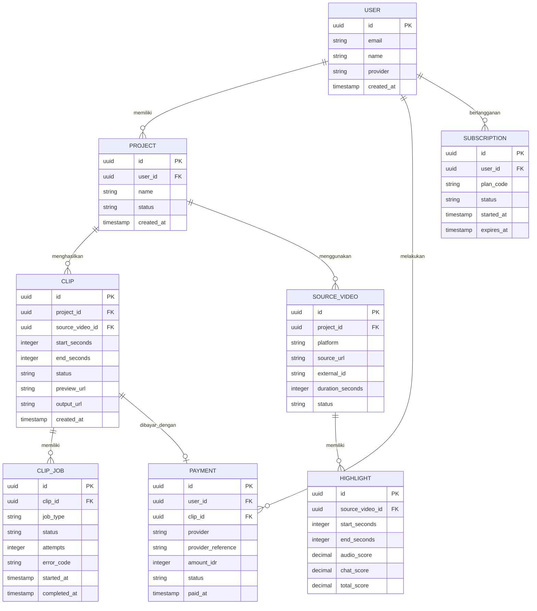

# PRD: KlipChip

## Ringkasan Produk

KlipChip adalah aplikasi web untuk mengubah video YouTube atau Twitch menjadi klip pendek vertikal dengan cepat. Pengguna dapat memasukkan URL video, memilih timestamp, lalu KlipChip menghasilkan potongan video 9:16 dengan auto-caption yang mampu menangani slang gaming lokal dan istilah umum kreator Indonesia.

MVP menargetkan kreator konten YouTube/Twitch dari berbagai kategori, dengan fokus awal pada gaming, livestream, Minecraft, FiveM, dan mobile game. Fitur pembeda utama adalah deteksi highlight berbasis audio spike dan aktivitas chat, bukan hanya pemotongan manual.

Model bisnis utama adalah pembayaran per clip. Paket langganan murah menjadi opsi lanjutan untuk kreator dengan volume penggunaan rutin. KlipChip diposisikan sebagai produk yang lebih cepat dan sederhana dibandingkan platform editing video lengkap, serta dapat berkembang menjadi engine highlight berbasis webhook server game.

## Pernyataan Masalah

Kreator sering memiliki video panjang atau rekaman livestream yang berisi banyak momen potensial, tetapi proses menemukan, memotong, memberi caption, dan menyiapkan format vertikal membutuhkan waktu serta keahlian editing.

Masalah utama yang diselesaikan:

- Kreator sulit menemukan highlight dari video berdurasi panjang.
- Timestamp dari chat dan penonton belum terhubung langsung dengan proses clipping.
- Editing manual untuk format 9:16 memperlambat publikasi ke Shorts, Reels, dan TikTok.
- Transkripsi bahasa Indonesia sering salah ketika menemukan slang, istilah gaming, nama server, dan istilah komunitas.
- Kreator dengan kebutuhan sesekali tidak ingin langsung membeli langganan bulanan.

Kondisi awal KlipChip harus memvalidasi apakah kreator bersedia membayar untuk klip siap-publikasi. Karena itu, alur MVP harus singkat: masukkan sumber video, pilih momen atau timestamp, proses, bayar, lalu unduh hasil.

## Tujuan & Objektif

### Tujuan Produk

Membantu kreator menghasilkan klip vertikal ber-caption dari video YouTube/Twitch dalam waktu kurang dari lima menit tanpa membutuhkan software editing profesional.

### Objektif MVP

- Mencapai waktu median dari URL dikirim hingga preview klip tersedia di bawah 3 menit untuk video yang kompatibel.
- Mencapai minimal 30% conversion rate dari pengguna yang membuat preview ke pembayaran clip pertama.
- Memvalidasi minimal 100 clip berbayar dalam 8 minggu setelah peluncuran publik.
- Mencapai tingkat keberhasilan render minimal 95%.
- Mencapai minimal 80% rating caption “dapat digunakan dengan koreksi ringan” berdasarkan feedback pengguna.
- Menjaga biaya pemrosesan per clip di bawah harga jual terendah dengan margin kotor yang positif.
- Mendapatkan minimal 25% pengguna berbayar yang membeli clip kedua dalam 30 hari.

### Prinsip Produk

- Cepat sebelum lengkap.
- Hasil dapat diedit ringan, bukan menggantikan software editing profesional.
- Harga transparan per clip.
- Tidak mengunduh atau memproses sumber yang tidak memiliki akses legal.

## Target Pengguna

### Segmen Utama

| Segmen | Kebutuhan | Prioritas |
|---|---|---:|
| Kreator gaming YouTube/Twitch | Menemukan momen seru dari livestream dan memberi caption slang gaming | P0 |
| Kreator umum YouTube/Twitch | Mengubah video panjang menjadi Shorts/Reels/TikTok | P0 |
| Admin komunitas atau editor kecil | Menghasilkan beberapa clip secara cepat untuk kreator | P1 |
| Pemilik server game | Memicu clip dari event server melalui webhook | P1 |

Pengguna utama adalah kreator individu atau tim kecil yang tidak memiliki editor penuh waktu. Mereka menggunakan laptop atau ponsel, memiliki akses ke URL YouTube/Twitch, dan mengutamakan kecepatan, hasil visual yang layak, serta biaya rendah.

MVP harus dapat digunakan oleh semua kategori konten yang sumber videonya kompatibel. Namun, model caption dan kamus istilah awal diprioritaskan untuk bahasa Indonesia, slang gaming, Minecraft, FiveM, dan istilah livestream.

## Fitur Inti

### P0 — Wajib MVP

| Fitur | User Story | Kriteria Penerimaan |
|---|---|---|
| Autentikasi ringan | Sebagai pengguna, saya ingin masuk agar clip dan saldo saya tersimpan | Mendukung email magic link atau Google OAuth; pengguna dapat melihat riwayat clip |
| Input URL YouTube/Twitch | Sebagai kreator, saya ingin memasukkan URL video atau livestream | Sistem memvalidasi URL, menampilkan metadata, dan menolak sumber yang tidak kompatibel |
| Input timestamp | Sebagai kreator, saya ingin menentukan awal dan akhir clip | Rentang 5–180 detik, validasi durasi, serta preview timestamp |
| Instant clip | Sebagai kreator, saya ingin menghasilkan clip vertikal dari timestamp | Video diproses dalam format MP4 H.264, rasio 9:16, resolusi minimal 720×1280 |
| Deteksi highlight audio spike | Sebagai kreator, saya ingin sistem menyarankan momen dengan suara paling menonjol | Sistem menampilkan daftar kandidat berdasarkan loudness dan perubahan energi audio |
| Analisis aktivitas chat | Sebagai kreator, saya ingin momen dengan chat ramai diprioritaskan | Chat yang tersedia dianalisis berdasarkan volume pesan dan lonjakan aktivitas |
| Auto-caption bahasa Indonesia | Sebagai kreator, saya ingin caption otomatis yang memahami slang lokal | Caption memiliki timestamp, dapat diedit, dan mendukung kamus istilah gaming |
| Preview dan editor ringan | Sebagai kreator, saya ingin memeriksa hasil sebelum membeli | Pengguna dapat mengubah teks caption, durasi, dan posisi caption secara terbatas |
| Pembayaran per clip | Sebagai kreator, saya ingin membayar hanya saat membutuhkan clip | Checkout mendukung payment gateway Indonesia, webhook pembayaran, invoice, dan status pembayaran |
| Unduh hasil | Sebagai kreator, saya ingin mengunduh clip siap-publikasi | Link unduhan tersedia setelah pembayaran berhasil dan memiliki masa berlaku terbatas |
| Riwayat dan status proses | Sebagai pengguna, saya ingin melihat clip yang pernah dibuat | Status minimal: draft, processing, preview, paid, completed, failed |

### P1 — Penting Setelah Validasi Awal

- Paket langganan murah dengan kuota clip bulanan.
- Batch processing beberapa timestamp.
- Integrasi webhook dari server game untuk memicu capture berdasarkan event.
- Template caption dan branding sederhana.
- Dukungan Twitch VOD dengan sinkronisasi chat yang tersedia.
- Penggunaan audio spike dan chat activity sebagai ranking highlight gabungan.
- Referral atau saldo bonus untuk pengguna baru.

### P2 — Tahap Lanjutan

- Auto-publish ke YouTube Shorts, TikTok, dan Instagram Reels.
- Deteksi momen berbasis konteks percakapan atau game event.
- Multi-user workspace untuk agensi.
- Highlight feed publik.
- Editor timeline lanjutan, efek visual, dan musik berlisensi.
- Integrasi langsung dengan OBS atau capture server mandiri.

## Alur Pengguna

1. Pengguna membuka landing page KlipChip dan melihat contoh hasil, harga per clip, serta batasan sumber video.
2. Pengguna masuk menggunakan Google OAuth atau magic link.
3. Pengguna memilih “Buat Clip” dan menempelkan URL YouTube atau Twitch.
4. Sistem mengambil metadata sumber dan memvalidasi akses serta durasi.
5. Pengguna memilih salah satu mode:
   - memasukkan timestamp manual; atau
   - meminta rekomendasi highlight berdasarkan audio spike dan aktivitas chat.
6. Sistem membuat draft clip dan menjalankan transkripsi audio.
7. Pengguna melihat preview vertikal dengan caption.
8. Pengguna mengoreksi teks caption, memilih gaya caption, dan meninjau durasi.
9. Pengguna memilih pembayaran per clip atau paket yang tersedia.
10. Payment gateway mengonfirmasi pembayaran melalui webhook.
11. Sistem menjalankan render final tanpa watermark atau sesuai hak paket.
12. Pengguna mengunduh file MP4 melalui link signed URL.
13. Sistem meminta rating singkat tentang kualitas caption dan relevansi highlight.

Jika proses gagal, pengguna mendapat alasan yang dapat dipahami, opsi mencoba ulang, dan pengembalian saldo otomatis bila pembayaran sudah berhasil tetapi render tidak selesai.

## Teknologi (Tech Stack)

### Frontend

- **Next.js 15 dengan React dan TypeScript**: SSR/SSG untuk landing page dan SEO, serta App Router untuk dashboard.
- **Tailwind CSS**: implementasi mobile-first yang konsisten.
- **TanStack Query**: pengelolaan status job, polling, cache, dan retry API.
- **React Hook Form + Zod**: validasi input URL, timestamp, dan pengaturan caption.
- **Video.js atau HTML5 video player**: preview video dengan overlay caption.

### Backend

- **NestJS dengan TypeScript**: API modular untuk autentikasi, job processing, pembayaran, dan webhook.
- **REST API dengan OpenAPI**: kontrak eksplisit antara frontend dan backend.
- **Redis + BullMQ**: antrean transkripsi, analisis, dan rendering secara asynchronous.
- **Worker Python**: FFmpeg, ekstraksi audio, analisis loudness, pengambilan metadata, dan pemrosesan video.
- **Whisper atau faster-whisper**: transkripsi bahasa Indonesia; kamus istilah digunakan untuk normalisasi caption.
- **FFmpeg**: trimming, crop 9:16, encoding, dan burning caption bila diperlukan.

### Database dan Infrastruktur

- **PostgreSQL 16**: data pengguna, project, clip, payment, dan job.
- **Object storage kompatibel S3**: menyimpan sumber sementara, preview, dan hasil final.
- **Cloud Run atau Kubernetes managed**: menjalankan API dan worker secara terpisah.
- **Cloudflare**: CDN, DNS, WAF, dan proteksi dasar.
- **GitHub Actions**: lint, test, build image, migration check, dan deployment otomatis ke staging serta production.
- **Sentry dan OpenTelemetry**: error tracking, tracing, serta observabilitas job.

## Skema Database

PostgreSQL digunakan karena data transaksi, status pembayaran, dan relasi job membutuhkan konsistensi serta auditability. `CLIP_JOB` dipisahkan dari `CLIP` agar setiap tahap asynchronous dapat diulang dan dilacak. File video tidak disimpan di database, melainkan di object storage dengan metadata dan signed URL di PostgreSQL. Data sumber dan output memiliki retention policy untuk mengendalikan biaya.

## Milestone & Timeline

| Fase | Durasi | Output |
|---|---:|---|
| Discovery dan desain teknis | 1 minggu | user flow, pricing awal, API contract, risiko legal sumber video |
| UX/UI dan design system | 1 minggu | landing page, dashboard, checkout, preview editor mobile-first |
| Fondasi platform | 2 minggu | autentikasi, project, database, storage, CI/CD, observabilitas |
| Pipeline video dan caption | 3 minggu | input URL, trimming, FFmpeg, transkripsi, kamus slang, preview |
| Highlight engine | 2 minggu | analisis audio spike, chat activity, ranking kandidat, rekomendasi timestamp |
| Pembayaran dan final render | 1 minggu | payment gateway, webhook, invoice, render final, signed download |
| QA dan closed beta | 2 minggu | pengujian browser, load test, uji caption, feedback 20–30 kreator |
| Peluncuran MVP | 1 minggu | production release, monitoring, dokumentasi bantuan, eksperimen harga |

Estimasi total: **13 minggu** dengan satu tim kecil yang terdiri dari product manager, designer paruh waktu, dua engineer full-stack, dan satu engineer media/ML. Integrasi webhook server game dimulai setelah pipeline inti stabil dan tidak menjadi dependency peluncuran MVP.

## Ruang Lingkup

### Termasuk MVP

- Web app responsive untuk desktop dan mobile.
- Login Google OAuth atau magic link.
- Input URL YouTube/Twitch yang kompatibel.
- Timestamp manual dan rekomendasi highlight.
- Analisis audio spike dan aktivitas chat bila data tersedia.
- Crop vertikal 9:16 dan caption otomatis bahasa Indonesia.
- Kamus slang gaming lokal yang dapat diperbarui oleh admin.
- Preview, koreksi caption sederhana, pembayaran per clip, dan unduhan.
- Riwayat project, status job, invoice, serta retry proses gagal.
- Landing page SEO dan halaman harga.

### Tidak Termasuk MVP

- Capture langsung dari game server.
- Pengambilan video dari sumber tanpa akses legal atau tanpa dukungan resmi.
- Editor video timeline lengkap.
- Auto-publishing ke platform sosial.
- Feed publik atau marketplace clip.
- Kolaborasi multi-user dan approval workflow.
- Dukungan semua bahasa dan semua format video.
- Aplikasi native iOS/Android.
- Penghapusan watermark berdasarkan manipulasi teknis; watermark ditentukan oleh paket komersial.

## Kebutuhan Non-Fungsional

### Performa

- Target Core Web Vitals pada landing page: LCP ≤ 2,5 detik, INP ≤ 200 ms, CLS ≤ 0,1 pada persentil ke-75.
- Dashboard interaktif dalam ≤ 3 detik pada koneksi 4G.
- Preview clip tersedia maksimal 3 menit untuk clip 30–60 detik pada kondisi normal.
- Gunakan CDN untuk asset statis dan signed URL untuk video.
- Lazy loading video, image optimization Next.js, dan pemisahan bundle dashboard.

### Kompatibilitas

- Mendukung dua versi mayor terakhir Chrome, Edge, Firefox, dan Safari.
- Responsive pada lebar 360 px hingga desktop 1440 px.
- Pengujian manual pada Safari iOS dan Chrome Android.

### Keamanan

- OAuth/magic link dengan token sekali pakai dan masa berlaku terbatas.
- Secret payment dan webhook disimpan di secret manager.
- Verifikasi signature webhook serta idempotency key untuk pembayaran.
- RBAC minimal untuk user dan admin.
- Rate limiting pada API dan endpoint pemrosesan.
- Signed URL dengan masa berlaku terbatas.
- Enkripsi TLS saat transit dan encryption-at-rest.
- Sanitasi URL dan validasi sumber untuk mengurangi SSRF serta penyalahgunaan worker.

### Reliability dan Skalabilitas

- Job asynchronous dapat retry maksimal tiga kali dengan exponential backoff.
- Status pembayaran dan render harus idempotent.
- Target availability API 99,5% per bulan.
- Backup PostgreSQL harian dan point-in-time recovery.
- Worker dapat scale berdasarkan panjang antrean.
- Monitoring untuk waktu proses, kegagalan render, biaya per job, dan kapasitas storage.

## Metrik Keberhasilan

### North Star Metric

**Jumlah clip berbayar dan berhasil diunduh per minggu.**

Metrik ini mengukur nilai yang benar-benar diterima kreator sekaligus validasi model pay-per-clip.

### Supporting Metrics

| Metrik | Definisi | Target awal |
|---|---|---:|
| URL-to-preview conversion | Persentase URL valid yang menghasilkan preview | ≥ 75% |
| Preview-to-paid conversion | Persentase preview yang dibayar | ≥ 30% |
| Paid-to-download rate | Clip berbayar yang berhasil diunduh | ≥ 95% |
| Median processing time | Waktu dari submit hingga preview | < 3 menit |
| Render success rate | Job final berhasil tanpa retry manual | ≥ 95% |
| Caption usability | Rating caption 4–5 dari 5 | ≥ 80% |
| Repeat purchase | Pembeli yang membeli clip kedua dalam 30 hari | ≥ 25% |
| Cost per clip | Total biaya infra dan ML per clip sukses | Di bawah harga jual |
| Retention | Pengguna membayar kembali dalam 30 hari | ≥ 20% |

Analytics menggunakan **PostHog** untuk event product dan funnel, **Google Analytics 4** untuk traffic marketing, serta Sentry/OpenTelemetry untuk error dan performa. Event utama: `url_submitted`, `highlight_generated`, `preview_ready`, `checkout_started`, `payment_succeeded`, `render_completed`, `clip_downloaded`, dan `caption_rated`.

## Risiko & Mitigasi

| Risiko | Dampak | Mitigasi |
|---|---|---|
| Perubahan kebijakan atau pembatasan API YouTube/Twitch | Sumber video atau chat tidak dapat diproses | Gunakan API dan metode resmi, tampilkan batasan platform, serta sediakan input timestamp dan sumber yang diizinkan |
| Hak cipta dan kepemilikan konten | Keluhan hukum dan pemblokiran layanan | Pengguna wajib menyatakan memiliki hak atau izin; sediakan mekanisme laporan; jangan memasarkan KlipChip sebagai alat menyalin konten |
| Biaya transkripsi dan rendering terlalu tinggi | Margin negatif | Batas durasi, resolusi, dan retention; worker autoscaling; ukur biaya per clip sejak closed beta |
| Caption slang tidak akurat | Hasil tidak siap dipublikasi | Kamus istilah editable, confidence flag, editor caption, dan feedback loop |
| Deteksi highlight tidak relevan | Pengguna tidak melihat manfaat AI | Tampilkan alasan skor, izinkan timestamp manual, dan gunakan rating untuk tuning ranking |
| Job gagal atau antrean panjang | Pengalaman buruk dan refund meningkat | Retry, dead-letter queue, monitoring, status transparan, serta kredit otomatis untuk job gagal |
| Pembayaran sukses tetapi hasil gagal | Kehilangan kepercayaan | Idempotent webhook, refund atau saldo pengganti, serta audit log transaksi |
| Pengguna menyalahgunakan server dan worker | Biaya serta risiko keamanan | Rate limit, batas durasi, validasi URL, isolasi worker, dan kuota per akun |
| Scope melebar ke webhook game dan social publishing | Peluncuran tertunda | Jadikan webhook sebagai P1 dan prioritaskan pipeline clip berbayar sebagai MVP |
| Harga tidak sesuai willingness to pay | Conversion rendah | Uji tiga tier harga, kupon beta, pay-per-clip sebagai default, dan langganan murah setelah data penggunaan tersedia |
